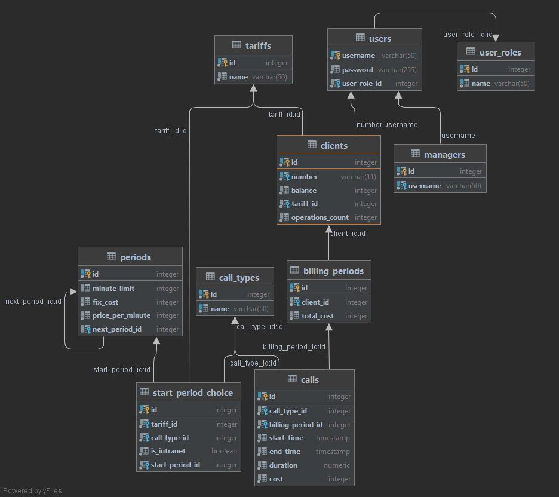

# Nexign Bootcamp Task

## Описание задания

Файл **CDR (Call Data Record)** собирается на коммутаторе - оборудовании, обрабатывающем звонки.

Этот файл содержит следующую обязательную информацию:

- тип вызова (01 - исходящие, 02 - входящие)
- номер абонента
- дата и время начала звонка (YYYYMMDDHH24MMSS)
- дата и время окончания звонка

Вот пример готовой записи **cdr**:

02,79876543221,20230321160455,20230321163211

**CDR** принимает **BRT (Billing Real Time)**.

Получив данные из **CDR BRT** авторизует абонентов оператора "Ромашка", чей баланс больше 0.

Для этого BRT связывается с базой клиентов в которойесть информация о абоненте: номер, тариф, баланс.

Тарифов всего 4:

- (06) Безлимит 300: 300 минут - за тарифный период стоят фиксированную сумму - 100р. Каждая последующая минута - 1р.
- (03) Поминутный: 1 минута разговора - 1.5 рубля.
- (11) Обычный: Входящие - бесплатно, исходящие - первые 100 минут по 0.5р/минута, после по тарифу "поминутный".
- (82) Тариф Х: Исходящие и входящие звонки абонентам оператора Ромашка - бесплатно. Всем остальным - расчет по тарифу "
  поминутный".

После авторизации **BRT** генерирует файл **CDR+**, который содержит уже информацию о тарифе абонента и передает его
в **HRS (High performance rating server)**.

HRS считает сколько денег нужно списать со счета абонента, исходя из длительности его разговоров и выбранного тарифа и
возвращает данные в **BRT**, который вносит изменения в базу и меняет баланс пользователя на соответствующую сумму.

Есть **CRM** система, в которой есть два уровня прав: **менеджер и абонент**.

- **Абонент** может пополнить счет и получить детализацию звонков.
- **Менеджер** может сменить тариф, создать нового пользователя и выполнять тарификацию.

## Описание решения

Решение представляет из себя многомодульный проект с использованием брокера сообщений. Файлы cdr.txt и cdr+.txt
генерируются, но отправка данных происходит через брокер сообщений.

### Используемые технологии:

- Java 17
- Spring Boot 3
- PostgreSQL
- ActiveMQ Artemis

### Проект состоит из следующих модулей:

- **cdr**: генерация CDR за месяц и оправление в **BRT**. У модуля есть различные параметры, например, количество
  сгенерированных номеров. При генерации месяц инкрементируется
- **brt**: авторизация абонентов Ромашки, генерация CDR+ и отправка в **HRS**
- **hrs**: расчет вызовов по тарифам абонентов и отправка данных обратно в **BRT**
- **crm**: модуль для управления системой с двумя ролями: клиент и менеджер
- **common**: модуль, содержащий общие типы и бины

### Схема базы данных:

Таблица вызовов соединяется с клиентами через таблицу billing_periods, которая создает новый период при каждой
тарификации (при запуске приложения либо при тарификации менеджером)

#### Хранение тарифов

Для хранения тарифа используется 3 таблицы: **tariffs, start_period_choice и periods**.

**Период** - это набор параметров тарифа, ограниченный по времени или нет, при этом периоды могут следовать друг за
другом. Так, например, Безлимит 300 состоит из двух последовательных периодов - первый имеет ограничение в 300 минут,
фиксированную стоимость в 100 рублей и нулевую поминутную стоимость, а второй не имеет ограничения по времени и
фиксированной стоимости, но стоит 1.5 рублей за минуту

Таблица **start_period_choice** предназначена для выбора первого периода тарифа в зависимости от типа звонка, а также
того, является звонок внутресетевым или нет

Таким образом система хранения тарифов получилась расширяемой, так как за счет хранения параметров тарификация
происходит по одному и тому же алгоритму, который реализован в модуле HRS